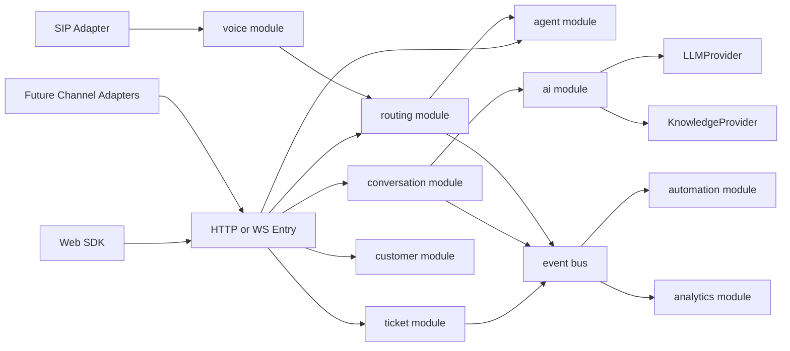
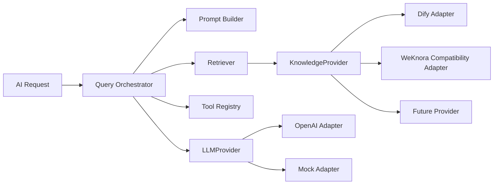
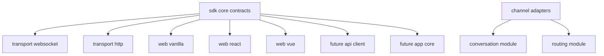
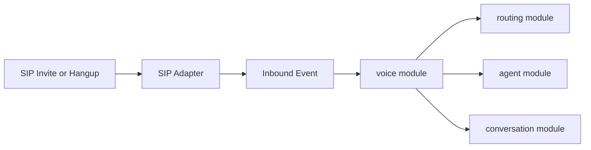

<p align="center">
  
</p>

<div align="center">

# 🛟 Servify

**开源智能客服系统** — Web 优先，AI 首答，人工接管，工单闭环

[](https://go.dev/)
[](LICENSE)
[](https://github.com/timebeau/servify/actions)
[](https://github.com/timebeau/servify)
[](https://www.servify.cloud/)

</div>

---

Servify 是一个面向企业独立部署的开源智能客服系统。

第一版产品目标先收敛在企业官网、品牌独立站、SaaS 官网和文档站的 Web 智能客服：站点嵌入客服入口，AI 基于知识库首答，复杂问题转人工并沉淀为工单。

它当前的产品重心不是“平台化多租户”，而是先把客服主链路做完整：`Web 接入 -> AI 首答 -> 人工接管 -> 转接协作 -> 工单闭环`。

当问题需要更强的引导和排查时，远程协助仍然是保留中的增强方向；但它不再作为第一版验收的中心能力。

当前仓库已经收敛到 `模块化单体` 架构，重点围绕会话、路由、工单、AI、知识库和后台运营持续演化；多端 SDK、更多渠道和语音能力属于后续扩展边界，而不是当前产品中心。

---

## 📊 当前状态

- ✅ 已形成智能客服产品骨架：`conversation`、`routing`、`ticket`
- ✅ 已具备 AI 与知识库基础能力：`ai`、`knowledge`
- ✅ 已具备远程协助所需的实时能力基础：WebSocket / WebRTC 相关链路、会话承接与统计入口已纳入产品演化
- ✅ 已把远程协助收敛为增强方向，而不是 V1 交付前提
- ✅ 已完成客服后台关键模块迁移：`agent`、`customer`
- ✅ 已补齐管理面安全基线首轮能力：认证、审计、token state revoke、session security surface
- ✅ 已明确 Web 优先、多端预留的演化方向
- 🔄 当前继续完善产品体验：工作台密度、接待流程收敛、运营与扩展能力

---

## 🎯 产品定位

Servify 当前更适合这样理解：

- 一个企业部署一套 Servify
- 访客从 Web 页面发起咨询
- AI 先做首答、澄清和知识召回
- 需要时可进一步升级到协助型处理，但主链路先保证 AI 首答、人工接管和工单闭环
- 坐席随时接管、协作、转接
- 无法即时解决的问题进入工单继续跟进
- 管理员在后台管理坐席、知识库、权限和基础配置

这意味着 `tenant/workspace` 更接近治理和隔离能力，而不是产品主叙事。

## 🛟 远程协助当前指什么

在 Servify 当前阶段，远程协助应该被理解为：

- 客户在 Web 会话中遇到需要一步步引导的问题时，客服可以从“解释”升级到“带着完成”
- AI、人工接管、实时交互和工单不是割裂的工具，而是一条连续服务链路
- 远程协助结束后，客服仍可以继续转接、协作或沉淀工单，而不是把上下文丢到外部系统

当前仓库已经具备这条能力链路的实时基础，包括会话、消息、WebSocket、WebRTC stats / connections、人工接管和后续工单衔接能力；管理端会话页也已经有最小协助入口，但它现在还不是一个“已经交付完整 co-browsing 产品”的承诺。

---

## 📁 仓库结构

```text
.
|-- apps/
|   |-- server/              # Go 服务端
|   |-- admin/               # Admin 管理面板（UmiJS + Ant Design Pro）
|   |-- admin-legacy/        # 旧版静态管理面板（保留用于演示/兼容）
|   |-- demo/                # 产品演示站点
|   |-- demo-sdk/            # SDK 预构建产物与示例
|   `-- website/             # 官网静态站点
|-- docs/
|   `-- implementation/      # 分主题实施 backlog
|-- infra/                   # compose、部署辅助
|-- internal/                # 共用内部包
`-- sdk/                     # SDK 工作区（源码）
```

## 🧪 常用校验入口

- `make local-check`
- `make security-check CONFIG=./config.yml`
- `make observability-check CONFIG=./config.yml`
- `make release-check CONFIG=./config.yml`

## 📂 根目录职责

### 应包含的内容

| 目录/文件 | 说明 |
|-----------|------|
| `apps/` | 应用入口与可运行表面，包括服务端、管理端、演示站点等 |
| `apps/server/` | Go 服务端（模块化单体架构） |
| `apps/admin/` | Admin 管理面板（UmiJS + Ant Design Pro） |
| `apps/admin-legacy/` | 旧版静态管理面板（保留用于演示/兼容） |
| `apps/demo/` | 产品演示站点与示例 |
| `apps/demo-sdk/` | SDK 预构建产物（UMD/ESM）与集成示例 |
| `apps/website/` | 官网静态站点 |
| `docs/` | 说明文档、实施 backlog、发布与协作规则 |
| `infra/` | 本地或部署环境相关的 compose、可观测性与辅助配置 |
| `scripts/` | CI、本地开发、生成物与检查脚本 |
| `sdk/` | SDK workspace 源码（TypeScript） |
| `config.yml`、`config.weknora.yml` | 本地运行配置样例；`config.yml` 默认使用 pgvector 自建知识库，`config.weknora.yml` 用于 WeKnora 兼容部署 |
| `config.production.secure.example.yml` | 生产环境安全配置模板 |
| `generated-assets.manifest` | 必须提交的生成物清单 |
| `Makefile`、`build.sh` | 常用构建与开发入口 |

### 不应长期出现的内容

- 本地构建二进制，例如 `server`、`server.exe`
- 运行时输出目录，例如 `uploads/`、`.runtime/`
- 临时调试文件、测试残留、缓存文件

---

## 🏗️ 架构原则

- 🧩 **业务模块化**：每个模块具备 `domain`、`application`、`infra`、`delivery`
- 🔌 **平台能力抽象**：认证、事件总线、AI/Knowledge provider、realtime/SIP 独立
- 🌐 **多端 SDK 预留**：Web 先落地，API/App 预留 contract，不做伪实现
- 📞 **语音能力隔离**：通过 `voice` 模块和 SIP adapter 接入，不耦合聊天链路
- 🔄 **Provider 可替换**：默认 pgvector 自建知识库，Dify 为推荐的外部知识源，WeKnora 为兼容实现之一

---

## 🧭 当前重点

当前阶段，Servify 优先做好这些事情：

- 把 Web 接入做成正式产品入口
- 把 AI 协同和人工接管打通
- 把转接、协作和工单闭环收完整
- 把后台运营和安全基线稳定下来
- 把远程协助保留为后续增强方向，而不是拉高 V1 复杂度

推荐先读：

- [V1 产品收敛](./docs/v1-product-scope.md)
- [远程协助产品说明](./docs/remote-assistance.md)
- [文档站首页](./docs/index.md)
- [v0.1.0 Release Notes](./docs/release-notes-v0.1.0.md)

当前不会把“平台化租户能力”作为产品中心持续扩张，而是先把独立部署客服产品做扎实。

---

## 🎯 总体架构



## 📦 业务模块边界

### ✅ 已落地模块

| 模块 | 状态 | 说明 |
| --- | --- | --- |
| `ticket` | 主路径收口（legacy 已删除） | 核心读写、命令、查询、事务边界、handler adapter 已完成 |
| `conversation` | 主路径收口 | 会话、消息、参与者、消息落库、最近历史读取已归拢 |
| `routing` | 主路径收口（legacy 已删除） | 人工接管、排队、分配、转接记录边界已独立 |
| `ai` | 主路径收口 | Query orchestrator、guardrails、tools、provider 抽象已到位 |
| `knowledge` | 主路径收口（facade 保留兼容） | 文档管理、索引任务、provider 抽象已到位 |
| `agent` | 主路径收口（facade 保留兼容） | handler DTO 与 transfer runtime contract 已回到 module delivery |
| `customer` | 主路径收口（facade 保留兼容） | handler/router/runtime 已直接走 module delivery |
| `automation` | 主路径收口（facade 保留兼容） | 触发器与执行查询已下沉到 module application |
| `analytics` | 主路径收口（facade 保留兼容） | 核心统计已走 module application，event bus subscriber 仍在 legacy |
| `suggestion` | 主路径收口（legacy 已删除） | 推荐、token/意图辅助逻辑已下沉到 module application |
| `gamification` | 主路径收口（legacy 已删除） | 评分、徽章逻辑已下沉到 module application |
| `voice` | 模块化（mixed） | 呼叫、媒体、录音、转写通过 `voice` 模块与 SIP adapter 接入；非典型 services→modules 迁移形态 |

各模块的迁移成熟度与 legacy service 角色，以 [迁移记分卡](./docs/implementation/10-migration-scorecard.md) 为准。

### 🔧 持续硬化方向

主链路模块均已落地并接入 router/runtime；当前的重点不是“再找一个模块收口”，而是：

- 继续压缩仍保留 facade 的模块（agent / customer / automation / analytics / knowledge）的 legacy 兼容层
- 收口仍以 legacy service 为主承载的业务（statistics、SLA、satisfaction、shift、workspace、macro、custom_field、app_integration）
- 扩大边界守护与验收证据覆盖

### 🔐 安全与管理面现状

| 能力 | 状态 | 说明 |
| --- | --- | --- |
| tenant / workspace scope | 已接入管理面 | 管理类路由统一经过 `AuthMiddleware`、`EnforceRequestScope`、`RequirePrincipalKinds`、`RequireResourcePermission` |
| 审计日志 | 已接入管理面 | 关键管理操作统一经过 `AuditMiddleware`，敏感字段做脱敏 |
| 用户 token 状态失效 | 已完成首轮能力 | 支持 `token_valid_after` + `token_version`，并在 router auth middleware 中强制校验 |
| 通用 user security surface | 已完成首轮能力 | 提供 `/api/security/users/:id` 与 `/api/security/users/:id/revoke-tokens` |
| 更细粒度 session / refresh token 管理 | 待补充 | 仍缺 refresh token、revoke list、批量失效、审批回滚等能力 |

---

## 🤖 AI 与知识库设计

Servify 的 AI 能力已经按照“编排层 + Provider”拆开。



**结论：**

- 默认知识源是 pgvector 自建知识库（见下节）；Dify 是推荐的外部知识源，WeKnora 是 compatibility 适配器之一
- 后续如果切 Milvus、Elasticsearch 或自研知识库，只需要新增 provider adapter（pgvector 已是内置 provider）
- AI 主流程不应该感知具体知识库实现，只依赖统一检索 contract

### 自建知识库 (pgvector)

Servify 现在支持基于 pgvector 的自建知识库，这是企业私有部署的推荐方案。

**配置:**

```yaml
embedding:
  provider: "openai"  # 或 tei, xinference
  openai:
    api_key: "${OPENAI_API_KEY}"
    model: "text-embedding-3-small"

knowledge:
  provider: "pgvector"
  pgvector:
    search:
      top_k: 5
      threshold: 0.7
```

**内网部署:**

使用 TEI (Text Embeddings Inference) 进行本地 embedding：

```bash
docker run -p 8080:8080 \
  ghcr.io/huggingface/text-embeddings-inference:cpu-1.5 \
  --model-id BAAI/bge-small-zh-v1.5
```

---

## 📦 SDK 与渠道预留

当前只实现 Web 方向，但架构已经预留多端 SDK 和多渠道接入。



设计约束：

- `sdk/packages/core` 只放跨端 contract，不放浏览器 UI 逻辑
- Web SDK 先实现，API/App SDK 只保留目录和协议设计
- 渠道接入统一映射到 `conversation` 和 `routing`，不允许直接穿透到旧 service

---

## 📞 SIP 与语音扩展

当前还没有完整实现全套语音协议栈，但架构上已经明确预留 `signaling + media` 两层扩展。



这意味着：

- SIP 不会变成聊天模块里的特殊分支
- SIP-WS、PSTN provider webhook 等未来也应走同一 signaling adapter 边界
- runtime 已内置 `voiceprotocol.Registry`，统一注册 SIP、SIP-WS、PSTN provider 和 WebRTC media adapter
- HTTP 已暴露统一协议入口：`/api/voice/protocols/:protocol/call-events/:event` 与 `/api/voice/protocols/:protocol/media-events/:event`
- 语音会先进入 `voice` 业务模型
- WebRTC、RTP/SRTP、录音、转写等媒体能力会走独立 media adapter
- 录音和转写也应走 provider 抽象，而不是把第三方云厂商 SDK 直接写进 `voice` service
- 当前录音/转写已形成独立应用层用例，后续只需要替换 provider
- 当前 runtime 已通过 `VoiceCoordinator` 将 WebRTC 生命周期挂入 `voice` 模块
- `voice` 再与 `routing`、`agent`、`conversation` 协同
- 后续支持呼叫转接、录音、转写、语音质检时，边界仍然清晰

---

## 🚀 快速开始

### 📋 环境要求

- **Go** 1.25.0（toolchain go1.25.7）- 项目使用 Go workspace 模式
- **PostgreSQL** 12+ 或 SQLite（开发/测试）
- **Node.js** 24+（仅 Web/管理端/文档相关任务需要）
  - 管理端使用 **pnpm** 10+ 作为包管理器
- 可选：**Docker** / **Docker Compose**

### 💻 常用命令

```bash
# 构建与运行
make build
make run                               # 启动服务端
make migrate                           # 数据库迁移

# 开发验证
make local-check                       # 本地环境检查
make security-check CONFIG=./config.yml
make observability-check CONFIG=./config.yml
make release-check CONFIG=./config.yml

# 仓库卫生
make repo-hygiene                      # 验证生成物未被跟踪
make generated-assets                  # 重新生成并验证提交的生成物

# 其他
make clean-runtime                     # 清理运行时输出
make release-changelog FROM=<tag> TO=HEAD
```

### 🔗 常用入口

- 健康检查：`GET /health`
- 就绪检查：`GET /ready`
- 指标端点：`GET /metrics`
- WebSocket：`GET /api/v1/ws?session_id=...`
- AI 查询：`POST /api/v1/ai/query`
- 语音协议列表：`GET /api/voice/protocols`
- 管理后台：`/admin/`
- 公开知识库：`/public/kb/docs`

**数据库配置：**
- 默认使用 PostgreSQL，可通过 `DB_DRIVER=sqlite` 切换到 SQLite（开发/测试）
- 发布检查脚本在默认配置下使用临时 SQLite 库完成自检

### 📈 可观测性

```yaml
monitoring:
  tracing:
    enabled: true
    endpoint: http://localhost:4317
    insecure: true
    sample_ratio: 0.1
    service_name: servify
```

本地追踪链路：

```bash
make docker-up-observ
```

Jaeger 默认地址：`http://localhost:16686`

---

## 📚 文档索引

### 📖 核心文档

- [ARCHITECTURE.md](./ARCHITECTURE.md)
- [docs/current-architecture.md](./docs/current-architecture.md) - 当前真实架构快照
- [docs/architecture-redesign-plan.md](./docs/architecture-redesign-plan.md) - 下一轮架构重设计计划
- [docs/index.md](./docs/index.md)
- [docs/WEKNORA_INTEGRATION.md](./docs/WEKNORA_INTEGRATION.md)
- [docs/CI_SELF_HOSTED.md](./docs/CI_SELF_HOSTED.md) - GitHub Hosted CI 说明
- [docs/repo-hygiene.md](./docs/repo-hygiene.md) - 运行时产物、生成物与 ignore 边界
- [docs/generated-assets.md](./docs/generated-assets.md) - 受控生成物、重建入口与校验规则
- [docs/local-development.md](./docs/local-development.md) - Windows / WSL / Linux 本地开发约定
- [docs/contributing.md](./docs/contributing.md) - 提交前自检与协作约定
- [docs/release-notes-v0.1.0.md](./docs/release-notes-v0.1.0.md) - v0.1.0 发布说明、已知限制与非目标

### 📋 实施 backlog

- [docs/implementation/README.md](./docs/implementation/README.md)
- [docs/implementation/01-platform-and-runtime.md](./docs/implementation/01-platform-and-runtime.md)
- [docs/implementation/02-ai-and-knowledge.md](./docs/implementation/02-ai-and-knowledge.md)
- [docs/implementation/03-business-modules.md](./docs/implementation/03-business-modules.md)
- [docs/implementation/04-sdk-and-channel-adapters.md](./docs/implementation/04-sdk-and-channel-adapters.md)
- [docs/implementation/05-engineering-hardening.md](./docs/implementation/05-engineering-hardening.md)
- [docs/implementation/06-voice-and-protocol-expansion.md](./docs/implementation/06-voice-and-protocol-expansion.md)
- [docs/implementation/07-sdk-multi-surface.md](./docs/implementation/07-sdk-multi-surface.md)
- [docs/implementation/08-ai-provider-expansion.md](./docs/implementation/08-ai-provider-expansion.md)
- [docs/implementation/09-runtime-and-repo-hygiene.md](./docs/implementation/09-runtime-and-repo-hygiene.md)
- [docs/implementation/10-service-to-module-migration.md](./docs/implementation/10-service-to-module-migration.md)
- [docs/implementation/10-migration-inventory.md](./docs/implementation/10-migration-inventory.md)
- [docs/implementation/10-migration-scorecard.md](./docs/implementation/10-migration-scorecard.md)
- [docs/implementation/10-module-boundaries.md](./docs/implementation/10-module-boundaries.md)
- [docs/implementation/11-tenant-auth-and-audit.md](./docs/implementation/11-tenant-auth-and-audit.md)
- [docs/implementation/12-operator-observability.md](./docs/implementation/12-operator-observability.md)

---

## 📈 当前实施进度

- `docs/implementation/01-08`：已清零（平台、AI、业务模块、SDK、工程化、语音、多端、AI 扩展）
- `docs/implementation/09-runtime-and-repo-hygiene.md`：**基本完成**
  - 运行时产物清理、ignore 策略、跨平台开发环境收敛
- `docs/implementation/10-service-to-module-migration.md`：**进行中**
  - `ticket`、`agent`、`analytics` 已收口到模块化链路
  - 详见 `10-migration-scorecard.md` 当前状态
- `docs/implementation/11-tenant-auth-and-audit.md`：**进行中**
  - 核心模型已补 `tenant_id`/`workspace_id` 字段与索引
  - 请求 scope 守卫已接入管理面
- `docs/implementation/12-operator-observability.md`：待开始

当前代码状态说明：

- 服务端已从”大 service 直连 handler”收敛到模块化单体结构
- `ticket`、`agent`、`analytics` 模块已收口到 `delivery -> application -> domain -> infra` 链路
- AI 已统一到 `QueryOrchestrator + LLMProvider + KnowledgeProvider`
- Dify 已作为默认优先知识源接入，WeKnora 已降级为 `KnowledgeProvider` 兼容适配器
- 管理面安全基线已接入首轮能力：scope、RBAC、audit、token policy
- 数据库层支持 PostgreSQL 与 SQLite（开发/测试回退）

---

## 🌐 官网部署

**[www.servify.cloud](https://www.servify.cloud/)** — 托管在 Cloudflare Pages，通过 GitHub Actions 自动部署。

### 首次设置

1. **创建 Cloudflare Pages 项目**
   - 登录 [Cloudflare Dashboard](https://dash.cloudflare.com)
   - 进入 **Workers & Pages** → **Create application** → **Pages** → **Connect to Git**
   - 选择 GitHub 仓库 `timebeau/servify`
   - 项目名称设为：`servify-website`
   - 构建设置（静态站点无需构建）：
     - 生产分支：`main`
     - 构建命令：留空
     - 构建输出目录：`apps/website`

2. **配置自定义域名**
   - 在 Pages 项目设置中添加 `www.servify.cloud` 和 `servify.cloud`
   - Cloudflare 会自动配置 DNS 和 SSL 证书

### 🚀 自动部署

当 `apps/website/` 目录下的文件有变更时，CI 会自动触发部署到 Cloudflare Pages。

---

## 🔄 CI 与文档发布

- GitHub Actions 工作流：`.github/workflows/ci.yml`
- 文档目录按 VitePress 使用方式组织：`docs/`
- CI 运行环境与检查项见 [docs/CI_SELF_HOSTED.md](./docs/CI_SELF_HOSTED.md)

---

## 🎯 现阶段结论

第一阶段与第二阶段主 backlog 已全部清零，当前进入第三阶段：

1. `09-runtime-and-repo-hygiene`：清理运行时脏产物、统一 ignore 策略、收口跨平台开发环境
2. `10-service-to-module-migration`：把旧 `services` / `handlers` 链路逐步收口到 `modules/*`
3. `11-tenant-auth-and-audit`：补齐租户、权限、审计、配置边界
4. `12-operator-observability`：补齐 tracing、metrics、日志、告警、回放与运营诊断能力

---

<div align="center">

**[⬆ 返回顶部](#-servify)**

Made with ❤️ by [timebeau](https://github.com/timebeau)

[](LICENSE)
[](https://github.com/timebeau/servify)

</div>
