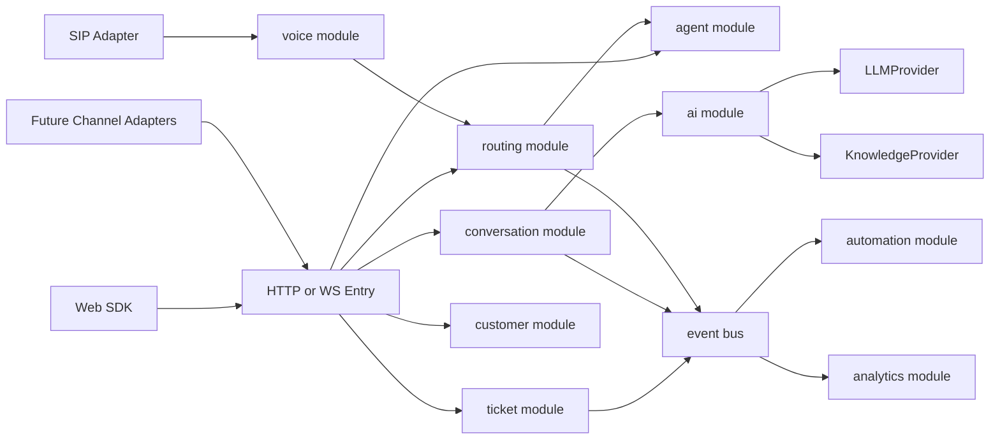
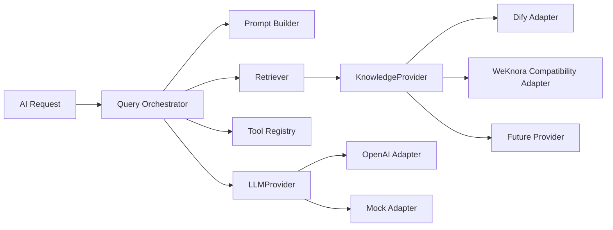
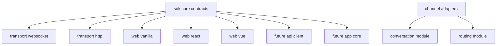
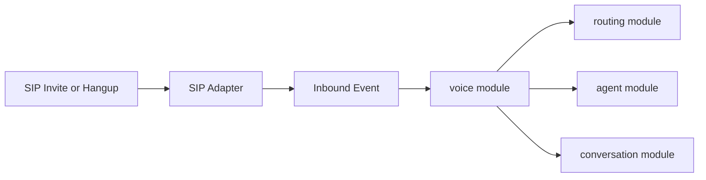

[English](README.md) | [中文](README.zh.md)

<p align="center">
  
</p>

<div align="center">

# Servify

**Open-source intelligent customer service system** — Web-first, AI first response, human takeover, full ticket lifecycle

[](https://go.dev/)
[](LICENSE)
[](https://github.com/cuihairu/servify/actions)
[](https://codecov.io/gh/cuihairu/servify)
[](https://servify.cuihairu.site/)

</div>

---

Servify is an open-source intelligent customer service system designed for enterprise self-hosted deployment.

The first release focuses on Web-based intelligent customer service for corporate websites, brand sites, SaaS marketing sites, and documentation sites: a site embeds a customer service entry point, AI answers first based on the knowledge base, and complex questions are escalated to human agents and recorded as tickets.

For now, the product completes the core service chain first and does not expand toward a multi-tenant platform: `Web entry -> AI first response -> human takeover -> transfer and collaboration -> full ticket lifecycle`.

Remote assistance remains a reserved enhancement direction for scenarios that need stronger step-by-step guidance and troubleshooting, but it is no longer a central acceptance capability of the first release.

The repository has converged on a `modular monolith` architecture, evolving around conversation, routing, ticket, AI, knowledge base, and back-office operations; multi-platform SDKs, additional channels, and voice capabilities are future extension boundaries rather than the current product center.

---

## Current Status

`v1.0.0` was released on 2026-10-04 (see the
[release notes](./docs/release-notes-v1.0.0.md)); all convergence batches
B0–B4 of the V1.0 overhaul passed their gates:

- Core service chain in place: `conversation` (central aggregate), `routing`, `ticket`
- AI and knowledge base productization: `ai` (first-response records / feedback loop / retrieval analytics), `knowledge`
  (source registration / document versions / index jobs / citation)
- Admin-plane security baseline: authentication, audit logging, token state revocation, session security
  surface, PII export/erasure, and retention policies
- 27 top-level modules, none added (enforced by an architecture gate); thin-shell modules are narrated as
  "sub-capabilities of the 7 core modules"
- Web-first with other surfaces reserved: the Web SDK is implemented, native Android/iOS SDKs landed with
  M1–M3, and voice and additional channels are frozen as extension boundaries
- Follow-up evolution: the routing scoring engine, pre-close ticket interception, and more (see "Evolution
  directions" in the release notes)

---

## Product Positioning

Servify is best understood this way at present:

- One enterprise deploys one Servify instance
- Visitors start a conversation from a web page
- AI handles the first response, clarification, and knowledge retrieval
- Escalation to assistance-style handling is available when needed, but the main chain guarantees AI first response, human takeover, and the full ticket lifecycle
- Agents can take over, collaborate, and transfer at any time
- Issues that cannot be resolved immediately move into tickets for follow-up
- Administrators manage agents, the knowledge base, permissions, and basic configuration in the admin console

This means `tenant/workspace` functions closer to a governance and isolation capability than the product's main narrative.

## What Remote Assistance Means Today

At the current stage, remote assistance should be understood as:

- When a customer hits a problem that needs step-by-step guidance in a web conversation, the agent can move from "explaining" to "completing it together"
- AI, human takeover, real-time interaction, and tickets live on one continuous service chain
- After remote assistance ends, the agent can still transfer, collaborate, or record a ticket, instead of dropping the context into an external system

The repository already has the real-time foundation for this capability chain, including conversations, messages, WebSocket, WebRTC stats / connections, human takeover, and downstream ticket linkage; the admin conversation page also has a minimal assistance entry point. It is not yet a commitment of a "fully delivered co-browsing product".

---

## Repository Structure

```text
.
|-- apps/
|   |-- server/              # Go server
|   |-- admin/               # Admin console (UmiJS + Ant Design Pro)
|   |-- demo/                # Product demo site
|   |-- demo-sdk/            # Prebuilt SDK artifacts and examples
|   `-- website/             # Official static website
|-- docs/
|   `-- implementation/      # Topic-based implementation backlogs
|-- infra/                   # Compose files, deployment helpers
|-- internal/                # Shared internal packages
`-- sdk/                     # SDK workspace (source)
```

## Common Verification Entry Points

- `make local-check`
- `make security-check CONFIG=./config.yml`
- `make observability-check CONFIG=./config.yml`
- `make release-check CONFIG=./config.yml`

## Repository Root Responsibilities

### What Belongs Here

| Directory / File | Description |
|-----------|------|
| `apps/` | Application entry points and runnable surfaces: server, admin console, demo site, etc. |
| `apps/server/` | Go server (modular monolith architecture) |
| `apps/admin/` | Admin console (UmiJS + Ant Design Pro) |
| `apps/demo/` | Product demo site and examples |
| `apps/demo-sdk/` | Prebuilt SDK artifacts (UMD/ESM) and integration examples |
| `apps/website/` | Official static website |
| `docs/` | Documentation, implementation backlogs, release and collaboration rules |
| `infra/` | Compose files, observability, and helper configuration for local or deployed environments |
| `scripts/` | CI, local development, generated-asset, and check scripts |
| `sdk/` | SDK workspace source (TypeScript) |
| `config.yml`, `config.weknora.yml` | Local runtime configuration samples; `config.yml` uses the self-hosted pgvector knowledge base by default, `config.weknora.yml` targets WeKnora-compatible deployments |
| `config.production.secure.example.yml` | Production security configuration template |
| `generated-assets.manifest` | Manifest of generated assets that must be committed |
| `Makefile`, `build.sh` | Common build and development entry points |

### What Should Not Linger Here

- Locally built binaries, such as `server`, `server.exe`
- Runtime output directories, such as `uploads/`, `.runtime/`
- Temporary debug files, test leftovers, cache files

---

## Architecture Principles

- **Modular business domains**: every module carries `domain`, `application`, `infra`, and `delivery`
- **Platform capability abstraction**: authentication, event bus, AI/Knowledge providers, realtime/SIP are independent
- **Multi-platform SDK reservation**: Web ships first, API/App contracts are reserved, no fake implementations
- **Voice capability isolation**: integrated through the `voice` module and a SIP adapter, decoupled from the chat chain
- **Replaceable providers**: the self-hosted pgvector knowledge base is the default, Dify is the recommended external knowledge source, and WeKnora is one compatible implementation

---

## Current Focus

At this stage, Servify prioritizes:

- Making the Web entry point a production-grade product surface
- Connecting AI collaboration and human takeover end to end
- Completing transfer, collaboration, and the full ticket lifecycle
- Stabilizing back-office operations and the security baseline
- Keeping remote assistance as a future enhancement instead of raising V1 complexity

Recommended first reads:

- [v1.0.0 Release Notes](./docs/release-notes-v1.0.0.md) (current release)
- [V1 Product Scope](./docs/v1-product-scope.md)
- [Web Embedding Guide](./docs/embedding-guide.md) (embedding the chat widget into your own site)
- [Documentation Home](./docs/index.md) (grouped by task: getting started / integration / deployment & operations / security / AI knowledge base)

The product will not keep expanding "platform-grade tenant capabilities" as its center; it first consolidates the self-hosted customer service product.

---

## Overall Architecture


```mermaid
flowchart LR
    WEB[Web SDK] --> GIN[HTTP or WS Entry]
    CHANNEL[Future Channel Adapters] --> GIN
    SIP[SIP Adapter] --> VOICE[voice module]
    GIN --> CONV[conversation module]
    GIN --> ROUTING[routing module]
    GIN --> TICKET[ticket module]
    GIN --> AGENT[agent module]
    GIN --> CUSTOMER[customer module]
    CONV --> AI[ai module]
    AI --> LLM[LLMProvider]
    AI --> KNOW[KnowledgeProvider]
    ROUTING --> AGENT
    VOICE --> ROUTING
    TICKET --> BUS[event bus]
    CONV --> BUS
    ROUTING --> BUS
    BUS --> AUTO[automation module]
    BUS --> ANALYTICS[analytics module]
```

## Business Module Boundaries

The V1.0 product center is **7 core modules** (conversation is the only central aggregate; see
[ARCHITECTURE.md §6](./ARCHITECTURE.md) and the
[V1.0 convergence plan](./docs/v1-convergence-plan.md)). All other business code is positioned as
"sub-capabilities of a core module" and no longer carries its own product narrative.

### The 7 Core Modules (V1.0 Product Center)

| Module | Product Positioning |
| --- | --- |
| `conversation` | **System central aggregate**: conversations, messages, participants, service timeline (`conversation_events` projection) |
| `routing` | Human takeover, queueing, assignment, transfer (scoring-based routing engine is a V1.0 enhancement) |
| `ticket` | Full ticket lifecycle: one-click ticket creation from a conversation, state machine, SLA/satisfaction attachment |
| `ai` | AI first response, agent assist (suggested replies / rewriting / summarization), knowledge-grounded answers |
| `knowledge` | Knowledge base documents, retrieval, and citation |
| `agent` | Agent profiles, presence/workload, data source for the three-pane agent workspace |
| `customer` | Customer profiles, tags, history, and ticket aggregation (customer 360) |

### Sub-capability Modules (thin shells attached to core modules, no longer top-level product concepts)

| Module | Belongs To | Description |
| --- | --- | --- |
| `sla` | → `ticket` | SLA evaluation / violation events, part of the ticket lifecycle |
| `satisfaction` | → `ticket` | Post-close satisfaction surveys |
| `custom_field` | → `ticket` | Custom fields applied to tickets |
| `shift` | → `agent` | Scheduling is a data source for agent availability |
| `macro` | → `agent` | Quick replies are an agent tool |
| `gamification` | → `analytics` | Performance scoring is a derived read model |
| `suggestion` | → `conversation` | Recommendations / intent assistance |
| `quality` | → `conversation` | Conversation analytics and quality inspection perspective |

Frozen (no new capability surfaces, excluded from product copy): `api_key`, `email`, `push`,
`webhook`, `translation`, `app_integration`, `auth` (capability surface frozen;
login/refresh/2FA/OIDC logic lives in `modules/auth/application` + `platform/auth`);
`voice` and its extensions (SIP/PSTN/transcription) are frozen as an extension boundary. **Architecture gate: no new top-level modules**;
new capabilities must first find a home as a sub-capability of an existing module.

### Engineering Perspective: Module Migration Maturity

For each module's migration maturity and the legacy service roles (including the `automation`/`analytics`
facade convergence and the plan for winding down legacy `statistics` handlers), refer to the
[migration scorecard](./docs/implementation/10-migration-scorecard.md) and the
[current architecture snapshot](./docs/current-architecture.md).

### Security and Admin-Plane Status

| Capability | Status | Description |
| --- | --- | --- |
| tenant / workspace scope | Wired into the admin plane | Admin routes uniformly pass through `AuthMiddleware`, `EnforceRequestScope`, `RequirePrincipalKinds`, `RequireResourcePermission` |
| Audit logging | Wired into the admin plane | Key admin operations uniformly pass through `AuditMiddleware`, with sensitive fields masked |
| User token state invalidation | First iteration complete | Supports `token_valid_after` + `token_version`, enforced in the router auth middleware |
| General user security surface | First iteration complete | Provides `/api/security/users/:id` and `/api/security/users/:id/revoke-tokens` |
| Session / refresh token management | First iteration complete | `POST /api/v1/auth/refresh`, `GET /auth/sessions`, `logout-current` / `logout-others`, TOTP 2FA, OIDC, and session risk tiers (refresh replay handling / sign-in risk) are all in place; the revocation list is carried by the platform `RevokedTokenPolicy`; remaining items are admin-plane enhancements such as approval rollback (outside the V1.0 scope) |

---

## AI and Knowledge Base Design

Servify's AI capability is split into an "orchestration layer + providers".


```mermaid
flowchart LR
    API[AI Request] --> ORCH[Query Orchestrator]
    ORCH --> PROMPT[Prompt Builder]
    ORCH --> RET[Retriever]
    ORCH --> TOOLS[Tool Registry]
    RET --> KP[KnowledgeProvider]
    ORCH --> LLM[LLMProvider]
    KP --> DIFY[Dify Adapter]
    KP --> WEK[WeKnora Compatibility Adapter]
    KP --> ALT[Future Provider]
    LLM --> OPENAI[OpenAI Adapter]
    LLM --> MOCK[Mock Adapter]
```

**Summary:**

- The default knowledge source is the self-hosted pgvector knowledge base (see the next section); Dify is the recommended external knowledge source, and WeKnora is one of the compatibility adapters
- Switching to Milvus or Elasticsearch later, or building a custom knowledge base, only requires a new provider adapter (pgvector is already a built-in provider)
- The main AI flow should not be aware of specific knowledge base implementations; it depends only on the unified retrieval contract

### Self-hosted Knowledge Base (pgvector)

Servify supports a self-hosted knowledge base based on pgvector, which is the recommended option for private enterprise deployments.

**Configuration:**

```yaml
embedding:
  provider: "openai"  # or tei, xinference
  openai:
    api_key: "${OPENAI_API_KEY}"
    model: "text-embedding-3-small"

knowledge:
  provider: "pgvector"
  pgvector:
    search:
      top_k: 5
      threshold: 0.7
```

**Intranet deployment:**

Use TEI (Text Embeddings Inference) for local embeddings:

```bash
docker run -p 8080:8080 \
  ghcr.io/huggingface/text-embeddings-inference:cpu-1.5 \
  --model-id BAAI/bge-small-zh-v1.5
```

---

## SDK and Channel Reservation

Only the Web direction is implemented today, but the architecture reserves multi-platform SDKs and multi-channel entry. (Update: native Android/iOS SDKs have landed with the mobile milestones M1–M3 (`sdk/android`, `sdk/ios`, distributed via SwiftPM/XCFramework); design and acceptance are documented in `docs/mobile-sdk-design.md`; multi-channel entry remains an extension boundary.)


```mermaid
flowchart TB
    CORE[sdk core contracts]
    TWS[transport websocket]
    THTTP[transport http]
    WEBV[web vanilla]
    WEBR[web react]
    WEBVU[web vue]
    API[future api client]
    APP[future app core]
    CH[channel adapters]

    CORE --> TWS
    CORE --> THTTP
    CORE --> WEBV
    CORE --> WEBR
    CORE --> WEBVU
    CORE --> API
    CORE --> APP
    CH --> CONV[conversation module]
    CH --> ROUTING[routing module]
```

Design constraints:

- `sdk/packages/core` holds only cross-platform contracts, no browser UI logic
- The Web SDK is implemented; the App SDKs (Android/iOS) have native implementations per `docs/mobile-sdk-design.md` (protocol contracts aligned with Web, runtime structure follows each platform's conventions); the API SDK remains directory and protocol design only
- Channel integrations map uniformly onto `conversation` and `routing`; reaching into legacy services directly is not allowed

---

## SIP and Voice Extension

The full voice protocol stack is not implemented yet, but the architecture explicitly reserves a `signaling + media` two-layer extension.


```mermaid
flowchart LR
    SIP[SIP Invite or Hangup] --> SADAPTER[SIP Adapter]
    SADAPTER --> IE[Inbound Event]
    IE --> VOICE[voice module]
    VOICE --> ROUTING[routing module]
    VOICE --> AGENT[agent module]
    VOICE --> CONV[conversation module]
```

This means:

- SIP will not become a special branch inside the chat modules
- SIP-WS, PSTN provider webhooks, and future variants should go through the same signaling adapter boundary
- The runtime ships a `voiceprotocol.Registry` that uniformly registers SIP, SIP-WS, PSTN providers, and WebRTC media adapters
- HTTP exposes unified protocol endpoints: `/api/voice/protocols/:protocol/call-events/:event` and `/api/voice/protocols/:protocol/media-events/:event`
- Voice events enter the `voice` domain model first
- Media capabilities such as WebRTC, RTP/SRTP, recording, and transcription go through dedicated media adapters
- Recording and transcription should also go through provider abstractions rather than embedding third-party cloud SDKs directly into the `voice` service
- Recording/transcription already exist as standalone application-layer use cases; only the provider needs replacing later
- The runtime already attaches the WebRTC lifecycle to the `voice` module via `VoiceCoordinator`
- `voice` then collaborates with `routing`, `agent`, and `conversation`
- When call transfer, recording, transcription, and voice quality inspection arrive later, the boundaries stay intact

---

## Quick Start

### Requirements

- **Go** 1.25.0 (toolchain go1.25.7) - the project uses Go workspace mode
- **PostgreSQL** 12+ or SQLite (development/testing)
- **Node.js** 24+ (only needed for Web / admin / documentation tasks)
  - The admin console uses **pnpm** 10+ as its package manager
- Optional: **Docker** / **Docker Compose**

### Common Commands

```bash
# Build and run
make build
make run                               # Start the server
make migrate                           # Run database migrations

# Development verification
make local-check                       # Local environment check
make security-check CONFIG=./config.yml
make observability-check CONFIG=./config.yml
make release-check CONFIG=./config.yml

# Repository hygiene
make repo-hygiene                      # Verify generated assets are not tracked
make generated-assets                  # Regenerate and verify committed generated assets

# Miscellaneous
make clean-runtime                     # Clean runtime output
make release-changelog FROM=<tag> TO=HEAD
```

### Common Endpoints

- Health check: `GET /health`
- Readiness check: `GET /ready`
- Metrics endpoint: `GET /metrics`
- WebSocket: `GET /api/v1/ws?session_id=...`
- AI query: `POST /api/v1/ai/query`
- Voice protocol list: `GET /api/voice/protocols`
- Admin console: `/admin/`
- Public knowledge base: `/public/kb/docs`

**Database configuration:**
- PostgreSQL is the default; switch to SQLite with `DB_DRIVER=sqlite` (development/testing)
- Under the default configuration, the release check script self-verifies against a temporary SQLite database

### Observability

```yaml
monitoring:
  tracing:
    enabled: true
    endpoint: http://localhost:4317
    insecure: true
    sample_ratio: 0.1
    service_name: servify
```

Local tracing stack:

```bash
make docker-up-observ
```

Jaeger is available by default at `http://localhost:16686`.

---

## Documentation Index

### Core Documents

- [ARCHITECTURE.md](./ARCHITECTURE.md)
- [docs/current-architecture.md](./docs/current-architecture.md) - Snapshot of the current real architecture
- [docs/embedding-guide.md](./docs/embedding-guide.md) - Web embedding guide (embedding methods, session identity handoff, ticket context, event callbacks, full theme table)
- [docs/architecture-redesign-plan.md](./docs/architecture-redesign-plan.md) - Architecture redesign plan (an artifact of the services→modules migration period, archived)
- [docs/index.md](./docs/index.md)
- [docs/WEKNORA_INTEGRATION.md](./docs/WEKNORA_INTEGRATION.md)
- [docs/CI_SELF_HOSTED.md](./docs/CI_SELF_HOSTED.md) - GitHub-hosted CI notes
- [docs/repo-hygiene.md](./docs/repo-hygiene.md) - Runtime artifacts, generated assets, and ignore boundaries
- [docs/generated-assets.md](./docs/generated-assets.md) - Controlled generated assets, rebuild entry points, and verification rules
- [docs/local-development.md](./docs/local-development.md) - Windows / WSL / Linux local development conventions
- [docs/contributing.md](./docs/contributing.md) - Pre-commit self-checks and collaboration conventions
- [docs/v1-convergence-plan.md](./docs/v1-convergence-plan.md) - **V1.0 product and architecture convergence plan (current baseline)**
- [docs/release-notes-v1.0.0.md](./docs/release-notes-v1.0.0.md) - **v1.0.0 release notes (current release)**
- [docs/release-notes-v0.1.0.md](./docs/release-notes-v0.1.0.md) - v0.1.0 historical release notes (superseded by V1.0, archived)

### Implementation Backlogs

- [docs/implementation/README.md](./docs/implementation/README.md)
- [docs/implementation/01-platform-and-runtime.md](./docs/implementation/01-platform-and-runtime.md)
- [docs/implementation/02-ai-and-knowledge.md](./docs/implementation/02-ai-and-knowledge.md)
- [docs/implementation/03-business-modules.md](./docs/implementation/03-business-modules.md)
- [docs/implementation/04-sdk-and-channel-adapters.md](./docs/implementation/04-sdk-and-channel-adapters.md)
- [docs/implementation/05-engineering-hardening.md](./docs/implementation/05-engineering-hardening.md)
- [docs/implementation/06-voice-and-protocol-expansion.md](./docs/implementation/06-voice-and-protocol-expansion.md)
- [docs/implementation/07-sdk-multi-surface.md](./docs/implementation/07-sdk-multi-surface.md)
- [docs/implementation/08-ai-provider-expansion.md](./docs/implementation/08-ai-provider-expansion.md)
- [docs/implementation/09-runtime-and-repo-hygiene.md](./docs/implementation/09-runtime-and-repo-hygiene.md)
- [docs/implementation/10-service-to-module-migration.md](./docs/implementation/10-service-to-module-migration.md)
- [docs/implementation/10-migration-inventory.md](./docs/implementation/10-migration-inventory.md)
- [docs/implementation/10-migration-scorecard.md](./docs/implementation/10-migration-scorecard.md)
- [docs/implementation/10-module-boundaries.md](./docs/implementation/10-module-boundaries.md)
- [docs/implementation/11-tenant-auth-and-audit.md](./docs/implementation/11-tenant-auth-and-audit.md)
- [docs/implementation/12-operator-observability.md](./docs/implementation/12-operator-observability.md)

---

## Current Implementation Progress (V1.0 Convergence Baseline)

The V1.0 convergence work was carried out per the [V1.0 convergence plan](./docs/v1-convergence-plan.md);
batch status, commit hashes, and gate evidence are tracked in [todo.md](./todo.md):

- **B1 (Domain boundaries / dual migration paths) ✅**: governance of the 7 core module boundaries and dependency directions,
  module dependencies restricted to `delivery → application → domain`, dual migration paths
  (postgres versioned SQL + sqlite AutoMigrate)
- **B2 (Agent workspace / unified routing events / PII retention) ✅**: unified paths for direct-assignment and reassignment events
  (`routing.agent_assigned` / `routing.transfer_completed`), credential export / PII erasure boundaries,
  retention-policy expiry erasure
- **B3 (Knowledge productization / AI feedback loop) ✅**: knowledge source registration and document versions,
  index-job HTTP surface, AI first-response persistence (REST + WS side-channel recording), feedback loop
  (`POST /api/v1/ai/feedback`, bound to visitor sessions), retrieval analytics read surface, visitor-side
  citation rows and feedback entries, and the admin Knowledge management page (sources / versions / jobs / analytics)
- **B4 (Closure and release) ✅**: TASKS.md / acceptance matrix / documentation-site baseline unification, all four release gates
  green (2026-10-04), `v1.0.0` released (see the
  [release notes](./docs/release-notes-v1.0.0.md))

Current code status notes:

- The server has converged to a modular monolith: `delivery -> application -> domain -> infra`
  layering; cross-module access goes through in-module contracts or events. The shared model layer (`internal/models`)
  is being consolidated: transitional alias references have been eliminated and are pinned by a parser-level gate; a handful of residual cross-module direct queries remain (see
  [modules-dependency-map](./docs/modules-dependency-map.md))
- AI is unified behind `QueryOrchestrator + LLMProvider + KnowledgeProvider`;
  the `ai` module carries first-response records, the feedback loop, and retrieval analytics (a side-channel observation path that fails silently)
- Knowledge retrieval has a two-tier structure: when `knowledge.provider = pgvector | local` is configured, configuration passes through directly
  (taking precedence over external sources); when unconfigured, an external source selection chain ragflow → dify → weknora applies,
  degrading level by level on health checks, ending with no knowledge source at all
  (real-mode evidence for external providers depends on environment credentials; mock/compatible modes leave a full trace)
- Admin-plane security baseline: scope, RBAC, audit, and token policy are wired into the admin plane
- The database layer supports PostgreSQL and SQLite (development/testing fallback), with dual migration paths

---

## Website Deployment

**[servify.cuihairu.site](https://servify.cuihairu.site/)** — hosted on Cloudflare Pages, deployed automatically on push by Cloudflare's Connect to Git integration (not via this repository's GitHub Actions). (The former servify.cloud domain was not renewed and has expired.)

### First-time Setup

1. **Create a Cloudflare Pages project**
   - Log in to the [Cloudflare Dashboard](https://dash.cloudflare.com)
   - Go to **Workers & Pages** → **Create application** → **Pages** → **Connect to Git**
   - Select the GitHub repository `cuihairu/servify`
   - Set the project name to: `servify-website`
   - Build settings (a static site needs no build):
     - Production branch: `main`
     - Build command: leave empty
     - Build output directory: `apps/website`

2. **Configure the custom domain**
   - Add `servify.cuihairu.site` in the Pages project settings
   - Cloudflare provisions DNS and the SSL certificate automatically

### Automatic Deployment

When files under `apps/website/` change and are pushed to `main`, Cloudflare Pages' Connect to Git integration redeploys automatically (deployment is triggered on the Cloudflare side; this repository's `.github/workflows/` contains no website deployment workflow; for manual deployment use `make website-deploy` / `make website-pages-deploy`).

---

## CI and Documentation Publishing

- GitHub Actions workflows: `.github/workflows/ci.yml`
- The docs directory is organized for VitePress usage: `docs/`
- CI runtime environment and checks are documented in [docs/CI_SELF_HOSTED.md](./docs/CI_SELF_HOSTED.md)

---

## Where Things Stand

The V1.0 convergence work (B0 documentation and architecture statements → B1 domain boundaries / dual migration paths → B2
unified routing events / PII retention → B3 knowledge productization / AI feedback loop → B4 closure
and release) has passed all gates, and `v1.0.0` is released. The earlier backlogs — runtime closure, services→modules
migration, tenant/audit/security baseline, and observability — have all been cleared (history in
[todo.md](./todo.md)).

Follow-up evolution follows the "Evolution directions" section of the [v1.0.0 release notes](./docs/release-notes-v1.0.0.md):
the routing scoring engine (multi-factor), pre-close ticket interception rules, and the remaining thin-shell module documentation cleanup.

---

<div align="center">

**[⬆ Back to top](#servify)**

Made with ❤️ by [cuihairu](https://github.com/cuihairu)

[](LICENSE)
[](https://github.com/cuihairu/servify)

</div>
