# 同类在线客服产品调研:功能、界面与交互

调研时间:2026-10-08。样本 12 家,国际 8 家(Intercom、Zendesk、Crisp、tawk.to、Tidio、LiveChat、HubSpot、Drift),国内 4 家(美洽、智齿科技、网易七鱼、环信)。功能与价格以各家官网、官方帮助中心当天页面为准,截图均为当天用浏览器实地拍摄,内嵌于下文对应位置,原始文件存放在 `docs/research/assets/`。

**一句话总览**:聊天窗、坐席工作台、机器人/AI、通知未读在 12 家里已是全数标配的入场门槛;真正的分化在工单(8 有 2 档 2 不做)、AI 计价方式(按次/按会话/打包)与主题定制深度;对 servify 的可搬运面收敛在「脚本嵌入 + 配置项事实标准 + 移动端自动避让」,详见[第四节可参考分析](#四-可参考分析)。

---

## 一、功能清单

结论先行:**聊天窗 12/12、坐席工作台 12/12、机器人或 AI 12/12、通知未读 12/12**——这四项已是标配,不构成选型差异;**工单分化最大**(8 家有、2 家放付费档、2 家不做,LiveChat 和 Drift 干脆没有),是差异化保留位;主题定制 9 家标配 3 家进付费档,数据看板 11 家标配——两者属于「预期内能力」,做了不加分、不做减分。servify v1 的功能面(会话 + 工单 + AI + 知识库)与样本中腰部产品持平。

图例:✔ 有;◐ 有但分档/需付费;— 未在采集页面见到。

| 产品 | 聊天窗(访客端) | 坐席工作台 | 工单 | 机器人/AI | 多渠道 | 主题定制 | 通知/未读 | 数据看板 |
|---|---|---|---|---|---|---|---|---|
| Intercom | ✔ Messenger | ✔ 收件箱 | ✔ | ✔ Fin($0.99/次解决) | ◐ WhatsApp/SMS/电话按量计费 | ✔ Launcher+Home 可配置 | ✔ | ✔ 预置报表,实时看板在 Expert |
| Zendesk | ✔ Web Widget | ✔ | ✔ 核心能力 | ✔ AI Agents | ✔ | ✔ 位置/圆角/三色/Logo | ✔ 声音提醒 | ✔ |
| Crisp | ✔ | ✔ 共享收件箱 | ◐ Plus 档 | ◐ 档内含 AI Chatbot | ◐ Essentials 起全渠道 | ✔ | ✔ Push | ◐ Plus 档高级分析 |
| tawk.to | ✔ | ✔ | ✔ | ✔ Apollo+AI Assist | ✔ | ✔ 颜色/位置/问候语 | ✔ Push+桌面/移动 App | ✔ |
| Tidio | ✔ | ✔ | ✔ | ✔ Lyro | ✔ WhatsApp/Instagram/Messenger | ✔ | ✔ | ✔ 统一报表 |
| LiveChat | ✔ | ✔ Inbox | — | ✔ AI Agent+AI 工具组 | ◐ | ✔ Live Editor | ✔ | ✔ Reports |
| HubSpot | ✔ 免费 | ✔ 会话收件箱 | ✔ | ✔ 免费 Chatbot Builder | ◐ | ✔ | ✔ Slack+移动端 | ✔ |
| Drift | ✔(已退役) | ✔ | — | ✔ 对话式营销起家 | ◐ | ✔ | ✔ | ✔ |
| 美洽 | ✔ | ✔ | ◐ | ✔ 大模型获客机器人 | ✔ 网站/公众号/抖音/小程序/APP | ✔ widget 高度自定义、iframe 嵌入 | ✔ 多方式提醒 | ✔ 数据看板 |
| 智齿科技 | ✔ | ✔ | ✔ 工单渠道 | ✔ 对接 OpenAI/DeepSeek/通义千问/文心一言/Claude | ✔ 含 WhatsApp | ◐ | ✔ | ✔ |
| 网易七鱼 | ✔ | ✔ | ✔ 含邮件工单、SLA | ✔ 物流/退款智能体 | ✔ | ◐ | ✔ 消息提醒 | ✔ 自定义报表+数据大屏 |
| 环信 | ✔ | ✔ 效率工作台 | ✔ 智慧工单 | ✔ 7×24 机器人(欢迎语/默认/重复/超时/转人工可配) | ✔ 在线/小程序/APP/视频/呼叫中心 | ◐ | ✔ | ✔ 数据大屏+智能质检 |

几条值得单独记下的事实:

- **工单在国内外的定位不同。** Zendesk 把工单当主干,在线聊天只是入口之一;Crisp 把工单放在最贵的 Plus 档($295/月)才给;七鱼和智齿把工单做成"一二线协同"的内部流转工具,和 SLA、满意度评价绑在一起([七鱼工单页](https://b.163.com/home/qiyu/worksheet))。
- **AI 报价方式已经分化。** Intercom 座席价 $29/$85/$132(年付)另收 Fin $0.99/次解决,官方自己的口径是"AI 用量大时这部分会超过座席费"([定价指南](https://www.intercom.com/learning-center/intercom-pricing));Tidio 按"可计费会话数"分档,Free 50 次、Starter $24.17/月起([定价页](https://www.tidio.com/pricing/));Zendesk 是座席价打包 AI,$19/$55/$115 每坐席每月(年付)([定价页](https://www.zendesk.com/pricing/))。
- **tawk.to 的免费不是补贴,是商业模式。** 坐席数、会话数、网站数都不限,收入来自按"站点"卖的附加包(去广告标识 $29/月起的说法来自第三方评测,官方口径见 [why-free](https://www.tawk.to/why-free/))。
- **Drift 已经退场。** drift.com 首页现在直接写"We've transitioned from Drift to 1mind",Salesloft 在 2026-03-06 宣布逐步关停并把客户导向 1mind([drift.com](https://www.drift.com/))。做获客型聊天机器人的样本少了一家,留着它是因为它证明了"只做售前对话"这条线撑不住独立产品。
- **国内四家的共同结构**是"在线客服 + 工单 + 机器人 + 呼叫中心"四件套,再各自加一块特色:七鱼加质检和报表大屏,环信加视频客服和小程序,智齿加出海和 WhatsApp,美洽把叙事压在获客上(官网首页通篇讲留资卡、名片卡、线索,产品介绍写着"3 分钟完成网站代码部署")([meiqia.com](https://www.meiqia.com/))。

---

## 二、界面截图

全部为 2026-10-08 浏览器实拍,原始文件在 `docs/research/assets/`。

节内规律先说:**官网产品页普遍放一张"聊天窗 + 坐席台"的并排图**,访客端在右下、坐席端占大面积(HubSpot、七鱼、智齿都是这个构图);真正把**配置界面**拍出来的是 Intercom 的 Messenger 设置文档与 Zendesk 的开发者文档;**价格页结构高度趋同**——左侧档位卡、右侧功能对勾表(Crisp 的四列表最典型:聊天窗/收件箱/移动 App/SDK/Push 放免费档,工单/白标/高级分析压到 Plus)。

### Intercom

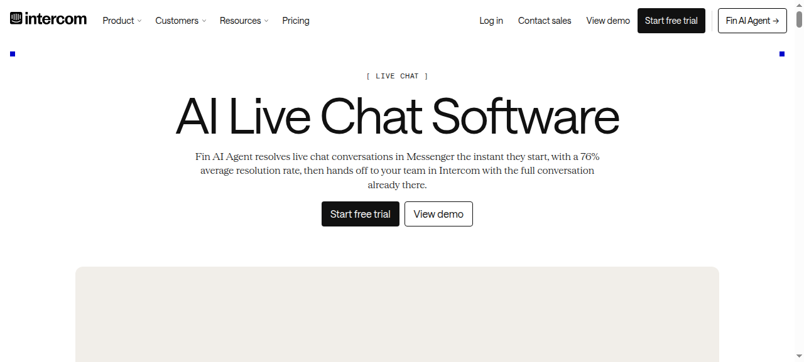
`intercom-live-chat.png` — [intercom.com/live-chat](https://www.intercom.com/live-chat)。产品页主视觉,对应功能清单里 Messenger 与 Fin 两行。

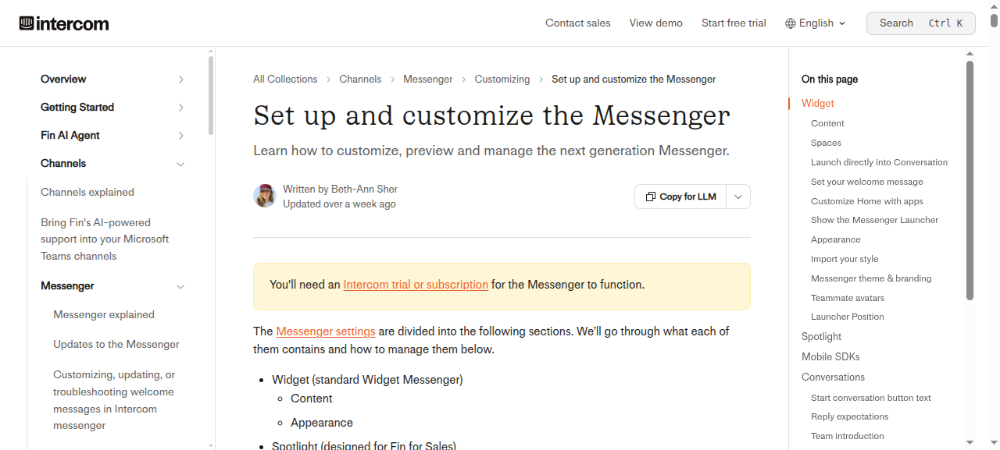
`intercom-messenger-docs.png` — [Messenger 设置文档](https://www.intercom.com/help/en/articles/6612589-set-up-and-customize-the-messenger)。本批截图里信息量最高的一张:右侧页面目录可见 Widget 下 Content / Spaces / Appearance / Import your style / Messenger theme & branding / Launcher Position 等配置分组,即第三节 3.3 的「事实标准清单」来源。

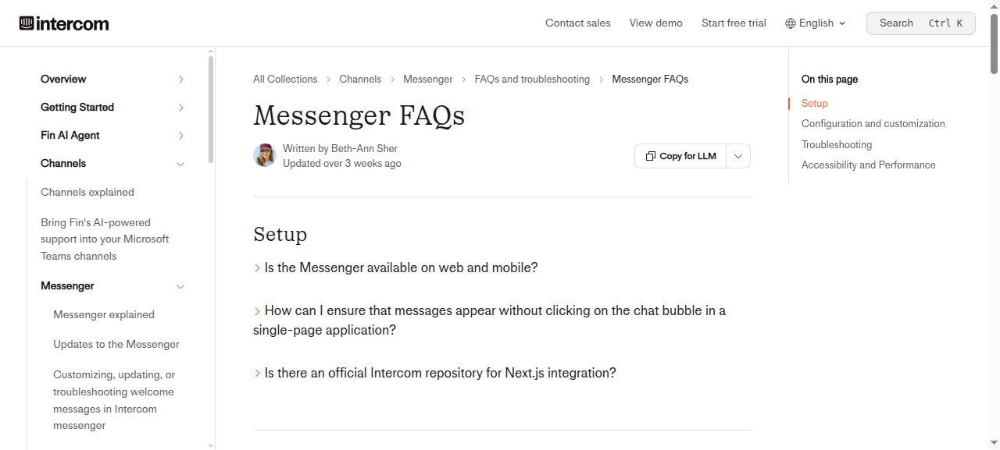
`intercom-messenger-faqs.png` — [Messenger FAQs](https://www.intercom.com/help/en/articles/6612597-messenger-faqs)。SPA 路由变化须调 `Intercom("update")` 的出处(3.2 节)。

### Zendesk

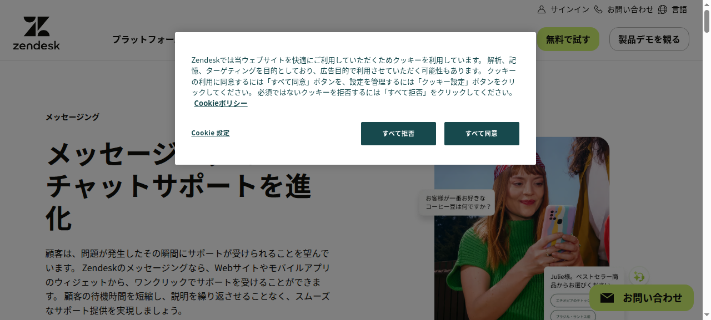
`zendesk-messaging.png` — [zendesk.co.jp/service/messaging](https://www.zendesk.co.jp/service/messaging/)(zendesk.com 按访问者 IP 跳日文站,原样保留)。

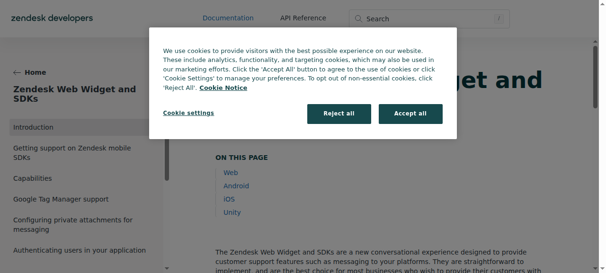
`zendesk-widget-docs.png` — [developer.zendesk.com](https://developer.zendesk.com/documentation/zendesk-web-widget-sdks/)。首屏被 cookie 同意弹窗遮挡,可见部分是 Web/Android/iOS/Unity 的 SDK 分章——Web Widget 与移动 SDK 并行的产品形态(3.1 节第三种深度)。

### Crisp

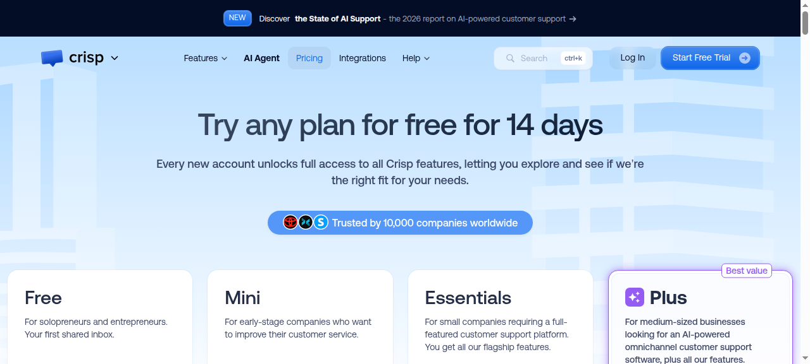
`crisp-pricing.png` — [crisp.chat/en/pricing](https://crisp.chat/en/pricing/)。价格页趋同结构的典型样本:档位卡 + 功能对勾表,工单在 Plus 档。

### tawk.to

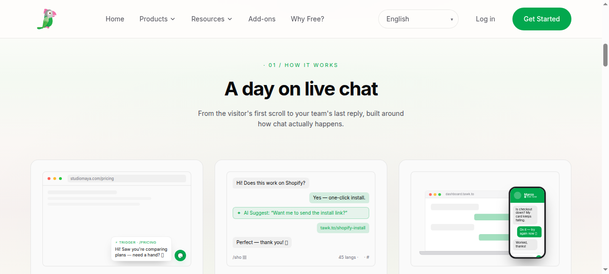
`tawk-live-chat.png` — [tawk.to/products/live-chat](https://www.tawk.to/products/live-chat/)。脚本嵌入、50+ 平台一键安装器、6 预设位、触发器欢迎语的出处(3.1/3.2/3.3 节)。

### Tidio

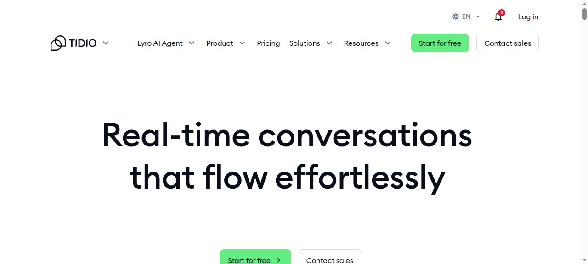
`tidio-live-chat.png` — [tidio.com/live-chat](https://www.tidio.com/live-chat/)。Lyro AI 与"进站即开窗"脚本的出处。

### LiveChat

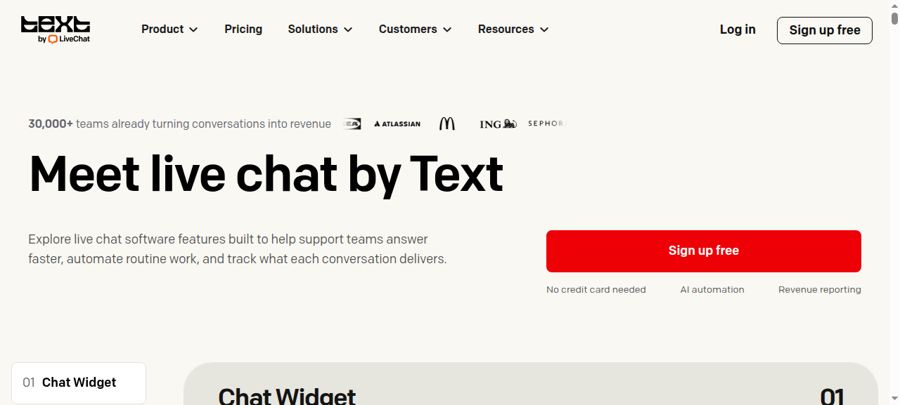
`livechat-features.png` — [livechat.com/features](https://www.livechat.com/features/)。Live Editor 所见即所得定制与 Reports 的出处(样本里唯一没有工单的正式产品)。

### HubSpot

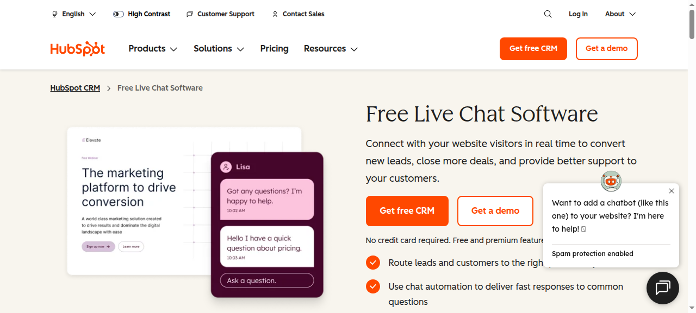
`hubspot-live-chat.png` — [hubspot.com/products/service/live-chat](https://www.hubspot.com/products/service/live-chat)。免费聊天窗 + 会话收件箱的"聊天窗+坐席台"并排构图。

### Drift

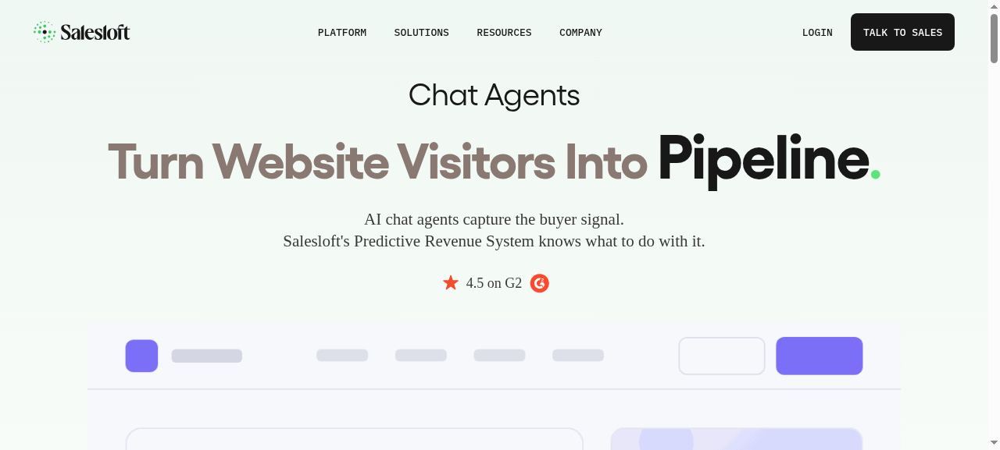
`drift-home.png` — [drift.com](https://www.drift.com/)。首页直接写 "We've transitioned from Drift to 1mind"——退场声明的原始证据。

### 美洽

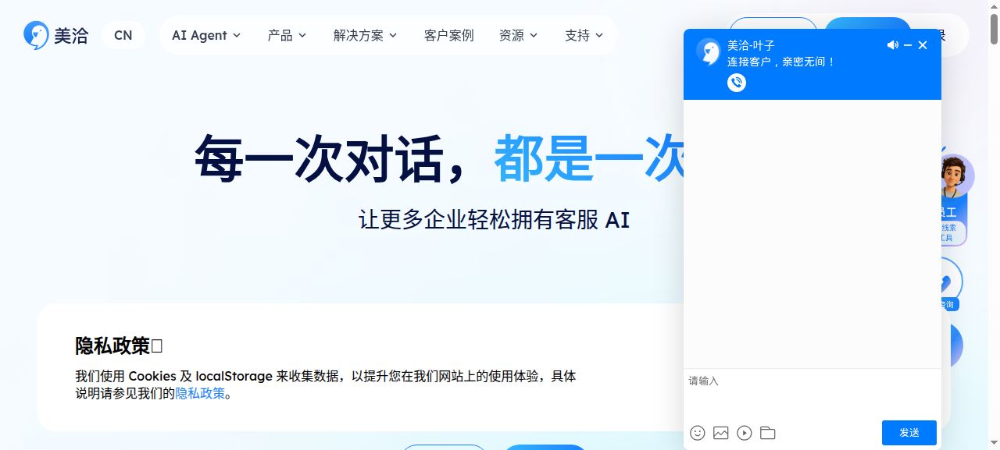
`meiqia-home.png` — [meiqia.com](https://www.meiqia.com/)。叙事压在获客:留资卡、名片卡、线索,"3 分钟完成网站代码部署"。

### 智齿科技

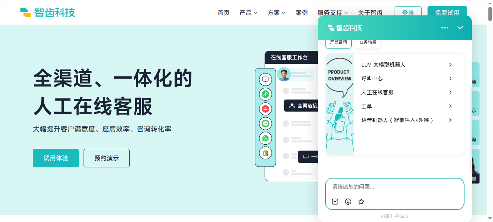
`zhichi-livechat.png` — [zhichi.com/livechat](https://www.zhichi.com/livechat/)。"聊天窗+坐席台"并排构图的国内样本,多渠道含 WhatsApp。

### 网易七鱼

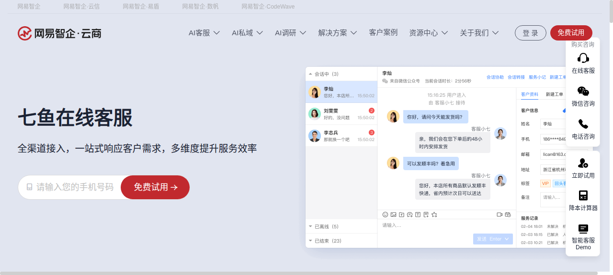
`qiyu-online-kefu.png` — [b.163.com/home/qiyu/onlinekefu](https://b.163.com/home/qiyu/onlinekefu)。大屏报表与质检特色的产品叙事。

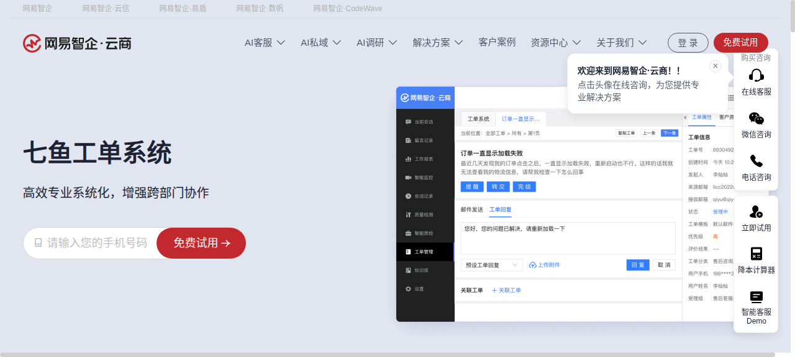
`qiyu-worksheet.png` — [b.163.com/home/qiyu/worksheet](https://b.163.com/home/qiyu/worksheet)。第四节「工单三件」最小闭环(多方式创建/关联与预设回复/满意度评价)的出处。

### 环信

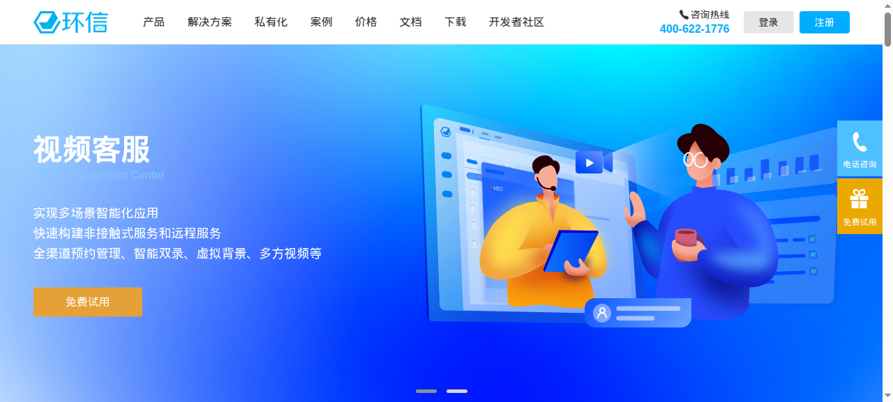
`easemob-cs.png` — [easemob.com/product/cs](https://www.easemob.com/product/cs)。效率工作台、数据大屏+智能质检、机器人五项可配(欢迎语/默认/重复/超时/转人工)的出处。

---

## 三、人机交互要点

### 3.1 嵌入方式

三种深度,对应三种集成成本:

1. **一段 `<script>`。** tawk.to 的安装文档就是一个 async 脚本贴到页面里,另配 Shopify/WordPress/Wix 等 50+ 平台的一键安装器([live-chat 页](https://www.tawk.to/products/live-chat/));Tidio 官方文档同样要求脚本放在 `</body>` 闭合标签之前,并给出可直接复制的完整片段([帮助文档](https://help.tidio.com/hc/en-us/articles/5464289229340-Opening-the-widget-automatically));美洽官网写"3 分钟完成网站代码部署"([meiqia.com](https://www.meiqia.com/))。
2. **客户端 JS API。** Zendesk 的 Web Widget API 允许在具体页面上改 widget 的设置和显示方式,不改后台配置([开发者文档](https://developer.zendesk.com/documentation/zendesk-web-widget-sdks/));tawk.to 用 `customStyle` 方法做像素级偏移,并且要在嵌入脚本之前定义才生效([位置文档](https://help.tawk.to/article/changing-the-widget-position));Tidio 暴露 `window.tidioChatApi`,`open()` 就能远程把窗口打开。
3. **SDK 与 iframe。** Intercom 的 Messenger 在移动端要装 SDK(iOS v15.2.0、Android、React Native、Cordova 各自版本号不同)[Messenger FAQs];Zendesk 除 Web Widget 外还有 Android/iOS/Unity SDK;美洽官网把"widget 高度自定义"和"iframe 嵌入"列为开放能力。

### 3.2 打开动线

- 默认动线都是"收起成气泡 → 点击展开 → 首屏是 Home 或问候语"。Intercom 把这一层拆成两个概念:Launcher(气泡)和 Messenger Home(首次点开的空间),Home、Messages、Tickets、Help、News、Tasks 六个空间可拖拽排序,Messages 不可关闭([Messenger 设置文档](https://www.intercom.com/help/en/articles/6612589-set-up-and-customize-the-messenger))。
- 主动打开是获客型产品的标配:tawk.to 的触发器按 URL、行为、来源页发出欢迎语([live-chat 页](https://www.tawk.to/products/live-chat/));Tidio 的做法最直白,官方给一段"进站即开窗"的脚本,还分桌面版和移动版两个变体;LiveChat 的 Campaigns 和美洽的"按停留时长/关键页面主动邀请"是同一类能力。
- SPA 场景有个共同坑:Intercom 要求每次路由变化调 `Intercom("update")`,否则消息不会自己冒出来([Messenger FAQs](https://www.intercom.com/help/en/articles/6612597-messenger-faqs))。

### 3.3 气泡样式

可配置项已经收敛成一套事实标准:

- **位置**:tawk.to 提供桌面端 6 个预设位(上/中/下 × 左/右),后台点选不用写代码,另有代码级微调([位置文档](https://help.tawk.to/article/changing-the-widget-position));Zendesk 只给左下/右下两选,配默认 16px 边距偏移。
- **颜色与形状**:Zendesk 的 Style 页能设主色(气泡与顶栏)、消息色、操作色,圆角 0–20px 滑杆,外加 Logo、标题、描述、附件开关、声音提醒([外观配置文档](https://support.zendesk.com/hc/en-us/articles/4500747797914-Configuring-the-name-and-appearance-of-the-Web-Widget))。
- **改法**:LiveChat 的 Live Editor 直接在真实网站上改,右侧预览分桌面/移动两个视图,分"收起态"和"展开态"两套主题,不用写 CSS([定制文档](https://www.livechat.com/help/customize-your-chat/))。

### 3.4 移动端适配

- 桌面的 6 个位置在移动端不通用:tawk.to 的位置说明写明预设位只针对台式和笔记本,移动端由 widget 自动重新排位以避开站点导航([位置文档](https://help.tawk.to/article/changing-the-widget-position))。
- 有产品干脆允许对移动端关掉网页 widget,改走 App:LiveChat 的配置器可以按访客是否来自移动设备禁用 widget([定制文档](https://www.livechat.com/help/customize-your-chat/));tawk.to 用原生 iOS/Android App + Push 承接离线会话([live-chat 页](https://www.tawk.to/products/live-chat/))。
- 移动端聊天窗基本都是占满视口的整页形态,桌面才是右下角的小卡片;国内四家则普遍是"网页 widget + 移动工作台 App"两条线并行,坐席侧和访客侧分开适配。

---

## 四、可参考分析

逐条给出结论、理由与本仓落点。结论分三档:**可参考**(直接照做或已对齐)、**可借鉴**(思想可取,按本仓形态改造)、**不适用**(与本仓交付形态/边界冲突)。总判断:访客端聊天窗的配置面与交互范式已被样本收敛成事实标准,本仓 v1 外观/主题令(C1-1/C1-2)落在标准之内;真正的开放差距在 **JS API 深度**(页面内改位置/开合/主题)与**主动运营触发器**,两项都已给出落点建议。

| # | 结论 | 项 | 为什么 | 落到本仓哪里 |
|---|---|---|---|---|
| 1 | 可参考 | 一段 `<script>` 作为入门嵌入,JS API 跟上 | 12 家里 9 家的入门动作是一段脚本;后台配置覆盖 80% 场景,剩 20% 要能在页面里改且写清"代码级覆盖后台级"的优先级(tawk.to `customStyle`、Zendesk 按页配置都证明了这一点) | todo **C1-4 集成指南**(`docs/embedding-guide.md` 已有脚本嵌入面);「代码级覆盖后台级」的优先级说明建议在指南里补一节 |
| 2 | 可参考 | 气泡配置项按事实标准做,不自造 | 位置(6 预设或左下/右下)、主色/消息色/操作色、圆角 0–20px、问候语、Logo/标题/描述、声音提醒——LiveChat 与 Zendesk 的文档就是这张清单 | todo **C1-1 组件外观配置面**已落地(icon 三档/主色调/圆角/悬浮位置四角/大小),与标准对齐;差距仅「6 预设位 vs 本仓四角」可作后续微调 |
| 3 | 可参考 | 移动端 widget 自动重新排位避让站点导航 | 三条路(占满视口/关掉走 App/自动避让)里 tawk.to 的自动避让成本最低,不用引入设备判断 | todo **C1-3/C1-4**(两风格测试页已含 375 变体;嵌入指南移动端章节写明避让策略);`widget-mobile.html` 原型即底部 sheet 形态 |
| 4 | 可参考 | 收起态/展开态两套主题 | LiveChat 分"收起态"和"展开态"两套主题是标配做法 | 本仓 **C1-2 已做亮暗两套独立配**(跟随宿主站或手动指定),已覆盖;若后续支持"按触发场景分主题"再回看此条 |
| 5 | 可参考 | SPA 每次路由变化需同步 widget 状态 | Intercom 的坑(不调 `update` 消息不冒出来)是所有 SPA 嵌入方都会踩的,提前写进指南能省一次支持成本 | `docs/embedding-guide.md` 增补「SPA 路由同步」小节(建议登记 todo C1-4 附注) |
| 6 | 可参考 | 工单最小闭环:会话转工单 + 流转 + SLA + 满意度评价 | 七鱼工单页给出的最小闭环与本仓 v1 范围一致 | **本仓已具备**:工单主闭环 todo P1-5 已闭环(`docs/ticket-workflow.md` 五态转移表);SLA 模型在 `models.go`(SLAConfig/SLAViolation);会话关联 `session.TicketID`。作验收对照用,无需新开发 |
| 7 | 可借鉴 | Launcher(气泡)与 Messenger Home(首屏空间)拆成两个概念 | 把「入口」与「入口后的空间」分开建模,Home 空间可拖拽排序——比"一个聊天窗"的粗粒度模型更耐扩展 | `docs/design/prototypes-v1/screens/widget-fab.html`(悬浮球三态)+ todo C1-2 品牌位;后续若做"首屏空间"(欢迎语/快捷入口/历史会话分区)按此模型 |
| 8 | 可借鉴 | 配置面板按 Content/Appearance/Install/Security 分组 | Intercom Messenger 设置的四类分组把「内容/外观/安装/安全」切开,接入方找配置项的心智负担最低 | todo C1-1/C1-2 配置面文档分组叙事可按此四类组织(`docs/embedding-guide.md` 的「组件与聊天窗主题」节) |
| 9 | 可借鉴 | 主动开窗触发器(按 URL/行为/来源页/停留时长) | 获客型产品的标配能力;对服务型产品用于「关键页面主动邀请」依然有效 | 登记 todo C1 后续增强(触发器配置面);当前本仓 widget 无此面,不阻塞 ferry 对接 |
| 10 | 可借鉴 | 按访客设备禁用网页 widget(改走 App) | 一行配置级能力;本仓移动端已有原生 SDK 会话页,网页 widget 与 App 二选一的策略对齐此做法 | `docs/embedding-guide.md` 移动端章节写明「移动端优先走 SDK 会话页,widget 可按需禁用」(登记 todo C1-4 附注) |
| 11 | 可借鉴 | Drift 退场教训:只做售前获客撑不住独立产品 | 能长期收费的样本(Intercom、Zendesk、智齿、七鱼)都是"获客 + 服务 + 工单"完整闭环 | `docs/v1-product-scope.md` 的产品边界叙事可引用此例(不新增功能,只作 scope 论据) |
| 12 | 不适用 | AI 按次计价(Fin $0.99/次解决) | servify 是私有化部署交付,无按次计价面;且该模式连 Intercom 自己都承认用量大时超过座席费,成本不可预期是卖点也是风险 | 无落点;仅在定价叙事出现时作为反例引用 |
| 13 | 不适用 | tawk.to 免费模式(按站点卖附加包) | 商业模式不同:本仓按私有化部署交付,不存在免费坐席+站点附加包的结构 | 无落点 |
| 14 | 不适用 | LiveChat Live Editor(真实网站所见即所得编辑) | 需要独立编辑器基建(注入式预览+双向同步),超出 v1 与 C1 令范围 | 远期观察;当前以「测试页两风格验证」(todo C1-3 已做)替代同等目标 |
| 15 | 不适用 | Zendesk 按页 API 覆盖后台配置的完整面 | 第 1 条已收「代码级覆盖后台级」的优先级原则;完整的按页覆盖 API 面是接入深度问题,v1 不展开 | JS API 最小面(开/关/定位)已并入第 1 条落点,其余远期 |

---

## 五、来源

**国际**

- Intercom 定价与功能:[intercom-pricing](https://www.intercom.com/learning-center/intercom-pricing)、[Messenger 设置](https://www.intercom.com/help/en/articles/6612589-set-up-and-customize-the-messenger)、[Messenger FAQs](https://www.intercom.com/help/en/articles/6612597-messenger-faqs)、[live-chat 产品页](https://www.intercom.com/live-chat)
- Zendesk:[定价](https://www.zendesk.com/pricing/)、[Web Widget 与 SDK](https://developer.zendesk.com/documentation/zendesk-web-widget-sdks/)、[名称与外观配置](https://support.zendesk.com/hc/en-us/articles/4500747797914-Configuring-the-name-and-appearance-of-the-Web-Widget)、[messaging 产品页](https://www.zendesk.com/service/messaging/)
- Crisp:[定价与功能对比表](https://crisp.chat/en/pricing/)
- tawk.to:[live-chat 产品页](https://www.tawk.to/products/live-chat/)、[首页](https://www.tawk.to/)、[widget 位置文档](https://help.tawk.to/article/changing-the-widget-position)、[why-free](https://www.tawk.to/why-free/)
- Tidio:[功能页](https://www.tidio.com/features/)、[定价页](https://www.tidio.com/pricing/)、[自动开窗文档](https://help.tidio.com/hc/en-us/articles/5464289229340-Opening-the-widget-automatically)
- LiveChat:[功能页](https://www.livechat.com/features/)、[widget 定制](https://www.livechat.com/help/customize-your-chat/)、[FAQ(价格档)](https://www.livechat.com/help/frequently-asked-questions/)
- HubSpot:[免费 live chat 产品页](https://www.hubspot.com/products/service/live-chat)
- Drift:[drift.com](https://www.drift.com/)(已并入 Salesloft/1mind)

**国内**

- 美洽:[meiqia.com](https://www.meiqia.com/)
- 智齿科技:[zhichi.com](https://www.zhichi.com/)、[在线客服页](https://www.zhichi.com/livechat/)
- 网易七鱼:[在线客服](https://b.163.com/home/qiyu/onlinekefu)、[工单系统](https://b.163.com/home/qiyu/worksheet)
- 环信:[客服云产品页](https://www.easemob.com/product/cs)

**说明**:各产品"15000+ 客户""移动端市占率 77.4%""独立解决 90% 常见问题"等数字均为官网自述,未做第三方核验,引用时按自述口径处理。
